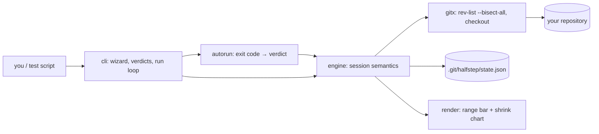

# halfstep

[English](README.md) | [中文](README.zh.md) | [日本語](README.ja.md)

[](LICENSE) [](go.mod) [](CHANGELOG.md)  [](CONTRIBUTING.md)

**halfstep：git bisect のためのオープンソースなガイド付きターミナル UI —— マーク・自動実行・縮んでいく容疑区間の可視化を担うウィザードが、最初の悪いコミットを逃げ場のないところまで追い詰める。**


```bash
git clone https://github.com/JaydenCJ/halfstep && cd halfstep
go build -o halfstep ./cmd/halfstep    # single static binary, stdlib only
```

> プレリリース：v0.1.0 はまだどのパッケージレジストリにもありません。上記の通りソースからビルドしてください（Go ≥1.22、PATH 上に git ≥2.30）。

## なぜ halfstep？

`git bisect` が「最速なのに誰も使わないデバッガ」であることに異論はないでしょう。アルゴリズム自体は完璧——log₂(n) 回の checkout でどんなリグレッションも追い詰められる——のに、ワークフローが人に厳しい：呪文の順番（`start`、次に bad、次に good）を暗記し、今どこまで来たのかは一切見えず、たった一度の `good` の打ち間違いが取り消し不能のまま探索全体を静かに汚染し、終盤の出力は信じるしかない文字の壁です。TUI も助けてはくれません：lazygit は bisect を区間フィードバックのないキーバインドの奥に隠し、tig にはそもそも bisect モードがありません。halfstep は git 自身の二分探索の頭脳をそのまま使い（中点はすべて `rev-list --bisect-all` が選ぶため、マージの挙動は git と完全に一致）、その周辺だけを置き換えるフロントエンドです：両端点を尋ねる開始ウィザード、判定のたびの区間バーと `~N steps to go` 見積もり、かつては探索全体を失わせた誤マークを取り消す `undo`、`git bisect run` の終了コード契約に完全準拠した `run`、そして skip が判定を阻むときに正直に出す `inconclusive` 容疑者リスト。状態は `.git/halfstep/` 配下の JSON ファイル 1 つに保存され、`refs/bisect` には決して触れないため、素の git bisect と共存できます。

| | halfstep | git bisect | lazygit | tig |
|---|---|---|---|---|
| ガイド付き開始（端点をプロンプトで質問） | ✅ ウィザード | ❌ 引数の順番を暗記 | ⚠️ キーバインドのメニュー | ❌ bisect モードなし |
| 判定ごとの区間可視化 | ✅ バー + 縮小チャート | ❌ 文字の件数のみ | ❌ | ❌ |
| 残りステップ数の見積もり | ✅ マークのたびに | ⚠️ 開始時に一度だけ | ❌ | ❌ |
| 誤った判定の取り消し | ✅ `undo` | ❌ log の手動リプレイ | ❌ | ❌ |
| 自動探索 | ✅ `run`（bisect-run コード） | ✅ `bisect run` | ❌ | ❌ |
| スクリプト可能な JSON ステータス | ✅ `schema_version: 1` | ❌ | ❌ | ❌ |
| ランタイム依存 | 0（Go 標準ライブラリ + 手元の git） | ——（git そのもの） | Go モジュール約 40 個 | C + ncurses |

<sub>依存数は 2026-07-13 に確認：halfstep は Go 標準ライブラリのみを import し、手元にある git バイナリを呼び出すだけ。lazygit 0.4x は約 40 モジュールを解決し、tig は ncurses をリンクします。halfstep v0.1.0 は good が bad の祖先であることを要求します——古典的な「経路上のリグレッション」のケースです。</sub>

## 特徴

- **開始は呪文ではなく対話** —— `halfstep start` は bad と good の端点を質問し（bad の既定は HEAD）、本当に区間を成すか検証し、汚れた作業ツリーを踏み荒らすことを拒み、最初の中点を即座に checkout します。
- **区間は常に見える** —— 判定のたびに、生き残った候補を元のスパンに写像するバケット圧縮バー、縮小の差分（`23 → 11 candidates`）、`~N steps to go` の半減見積もりを表示。1000 コミット中の孤独な生存者もバーから消えることはありません。
- **誤マークは取り消せる** —— かつて誤った `good` 一発はやり直しを意味しました。`halfstep undo` は残りのマークをリプレイして直近の判定を取り消し、何度でも遡れます。
- **自動実行は bisect-run 語を話す** —— `halfstep run -- ./test.sh` は `git bisect run` と同一の終了コード契約（0 良、125 スキップ、1–127 悪、128+ は記録せず中止）を使うため、既存の bisect スクリプトが無改造で動き、ステップごとに進捗を 1 行表示します。
- **正直な結末** —— 発見時は作者・日付・件名・所要ステップ数入りの犯人ボックスを、スキップ済みコミットしか残らないときは答えを捏造せず明示的な `inconclusive` 容疑者リストを出します。
- **構造からくる安全** —— 中点は git 自身の `rev-list --bisect-all` が選び（マージ込み）、矛盾するマークは保存前に拒否され、状態は `.git/halfstep/` 配下のアトミックに書かれる JSON ファイル 1 つで、`reset` は必ず出発したブランチへ戻します。

## クイックスタート

```bash
# something broke between the v1.2.0 release and today
halfstep start --good v1.2.0 --bad HEAD
```

実際にキャプチャした出力：

```text
halfstep: hunting the first bad commit in 4f96b85..e7030f8 (23 commits)

  good 4f96b85 [███████████████████████] e7030f8 bad
  23 candidates · ~5 steps to go

→ checked out 6db2327 "chore: bump linters" (step 1)
  test it, then: halfstep good | halfstep bad | halfstep skip
  or hand the wheel over: halfstep run -- <your test command>
```

checkout をテストしてマークし、区間が半分になるのを眺める——残りは自動化に任せてもかまいません：

```bash
halfstep bad                       # this checkout is broken too
halfstep run -- ./test.sh          # let the test drive from here
```

```text
step 2  ✓ good  e9b0e4c perf: memoize glob matches       exit 0   ·  11 → 6   [·····██████············]
step 3  ✓ good  1faf8e9 fix: windows paths               exit 0   ·   6 → 3   [········███············]
step 4  ✗ bad   6c713d2 cache: drop rename invalidation  exit 1   ·   3 → 1   [········█··············]

┌──────────────────────────────────────────────
│ first bad commit: 6c713d2
│ author : Rin Developer <rin@example.test>
│ date   : 2026-06-06
│ subject: cache: drop rename invalidation
└──────────────────────────────────────────────
  found in 4 steps · 23 candidates narrowed to 1
  HEAD is on the culprit — 'halfstep reset' returns to main
```

`halfstep log` は探索全体を縮小チャートとして再生し、`halfstep status --format json` は安定した `schema_version: 1` エンベロープで同じ情報をスクリプトに渡します。

## コマンドと終了コード

| コマンド | 役割 |
|---|---|
| `start [--bad rev] [--good rev]…` | 探索を開始。足りない端点はプロンプトで質問。`--force` で汚れチェックを上書き |
| `good` / `bad` / `skip [rev]` | テスト中のコミット（または `rev`）をマークし、次の中点へ進む |
| `undo` | 直近の判定を取り消す（開始時点まで何度でも） |
| `run -- <command…>` | bisect-run の終了コード意味論で自動探索。`--verbose` でテスト出力を流す |
| `status [--format text\|json]` | 区間バーと次にやること。人間向けにも機械向けにも |
| `log` | スケール付き縮小チャートとしての判定履歴 |
| `reset` | 元のブランチに戻りセッションを消去（冪等） |

| フラグ | 既定値 | 効果 |
|---|---|---|
| `-C <dir>` | `.` | 別のリポジトリに対して実行。git の `-C` と同様（サブコマンドの前に置く） |
| `--color` | `auto` | `auto`・`always`・`never` |
| `--width` | `40`（`log` は 24） | バー / チャートのセル幅 |

終了コード：`0` 正常 · `1` 二分探索の問題（セッションなし・矛盾・判定不能） · `2` 使い方の誤り · `3` git または実行時エラー。`run` 中のテストコマンドの終了コードは：`0` 良、`125` スキップ、`1–127` 悪、`128+` は判定を記録せず探索を中止。

## 検証

このリポジトリは CI を一切同梱しません。上記の主張はすべてローカル実行で検証されます：

```bash
go test ./...            # 90 deterministic tests, offline, zero sleeps, < 30 s
bash scripts/smoke.sh    # full manual + automated hunt end to end, prints SMOKE OK
```

テストは固定した `git fast-import` ストリーム（固定の作者名とタイムスタンプ）から実リポジトリを構築するため、すべての sha とバーが再現可能です。エンジンのスイートは線形履歴の**すべての**位置にバグを植え、探索が log₂ 予算内でちょうどそのコミットを追い詰めることを、マージ込みで検証します。

## アーキテクチャ



`render` と `autorun` は純粋（I/O なし）、`engine` がすべてのルールを持ち、外部コマンドを呼ぶのは `gitx` だけ——それも plumbing コマンドのみで、`git bisect` 自体は決して呼びません。状態ファイルの形式は [docs/state-format.md](docs/state-format.md) に記載しています。

## ロードマップ

- [x] v0.1.0 —— 開始ウィザード、good/bad/skip/undo、bisect-run 互換の自動探索、区間バー + 縮小チャート、JSON ステータス、90 テスト + スモークスクリプト
- [ ] 非リグレッション探索向けの `halfstep terms`（fixed/unfixed、old/new ラベル）
- [ ] squash-merge 履歴向けの first-parent モード
- [ ] 初期区間を狭める pathspec 絞り込み（`halfstep start -- src/parser/`）
- [ ] `status --format json` から新しいクローンへの探索リプレイ
- [ ] 同じエンジンの上に載るフルスクリーン TUI モード（オプション）

完全なリストは [open issues](https://github.com/JaydenCJ/halfstep/issues) を参照してください。

## コントリビュート

Issue・議論・PR を歓迎します —— ローカルのワークフロー（フォーマット、vet、テスト、`SMOKE OK`）は [CONTRIBUTING.md](CONTRIBUTING.md) へ。入門タスクには [good first issue](https://github.com/JaydenCJ/halfstep/issues?q=is%3Aissue+is%3Aopen+label%3A%22good+first+issue%22) ラベルが付き、設計の議論は [Discussions](https://github.com/JaydenCJ/halfstep/discussions) で行われています。

## ライセンス

[MIT](LICENSE)
