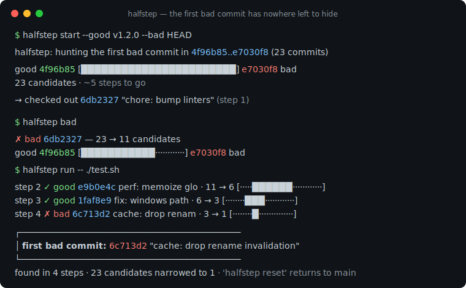
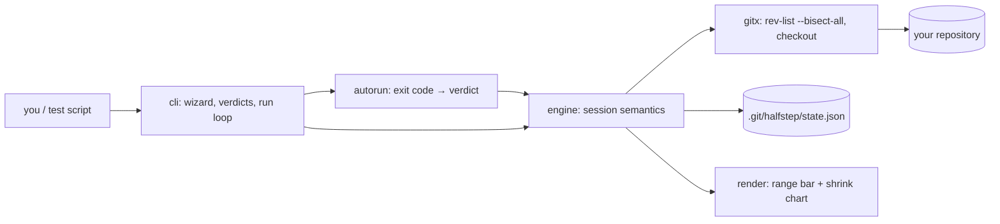

# halfstep

[English](README.md) | [中文](README.zh.md) | [日本語](README.ja.md)

[](LICENSE) [](go.mod) [](CHANGELOG.md)  [](CONTRIBUTING.md)

**halfstep：an open-source guided terminal UI for git bisect — a wizard that marks, auto-runs, and visualizes the shrinking range until the first bad commit has nowhere left to hide.**



```bash
git clone https://github.com/JaydenCJ/halfstep && cd halfstep
go build -o halfstep ./cmd/halfstep    # single static binary, stdlib only
```

> Pre-release: v0.1.0 is not on a package registry yet; build from source as above (any Go ≥1.22, git ≥2.30 on PATH).

## Why halfstep?

Everyone agrees `git bisect` is the fastest debugger nobody uses. The algorithm is perfect — log₂(n) checkouts to corner any regression — but the workflow is hostile: you must remember the incantation order (`start`, then bad, then good), you get no picture of where you are, a single mistyped `good` silently poisons the whole hunt with no undo, and the endgame output is a wall of text you have to trust. The TUIs don't rescue you: lazygit tucks bisect behind a keybinding with no range feedback, and tig has no bisect mode at all. halfstep is a frontend that keeps git's own bisection brain (`rev-list --bisect-all` picks every midpoint, so merges behave exactly as git would) and replaces everything around it: a start wizard that asks for the two endpoints, a range bar and `~N steps to go` estimate after every verdict, `undo` for the mis-mark that used to cost you the session, `run` with the exact `git bisect run` exit-code contract, and an honest `inconclusive` suspect list when skips block a verdict. State lives in one JSON file under `.git/halfstep/` and never touches `refs/bisect`, so it coexists with raw git bisect.

| | halfstep | git bisect | lazygit | tig |
|---|---|---|---|---|
| Guided start (prompts for endpoints) | ✅ wizard | ❌ flag order to memorize | ⚠️ keybinding menu | ❌ no bisect mode |
| Range visualization per verdict | ✅ bar + shrink chart | ❌ text count only | ❌ | ❌ |
| Steps-remaining estimate | ✅ after every mark | ⚠️ once, at start | ❌ | ❌ |
| Undo a wrong verdict | ✅ `undo` | ❌ manual log replay | ❌ | ❌ |
| Automated hunt | ✅ `run` (bisect-run codes) | ✅ `bisect run` | ❌ | ❌ |
| Scriptable JSON status | ✅ `schema_version: 1` | ❌ | ❌ | ❌ |
| Runtime dependencies | 0 (Go stdlib + your git) | — (is git) | ~40 Go modules | C + ncurses |

<sub>Dependency counts checked 2026-07-13: halfstep imports the Go standard library only and shells out to the git binary you already have; lazygit 0.4x resolves ≈40 modules; tig links ncurses. halfstep v0.1.0 requires good to be an ancestor of bad — the classic regression-on-a-path case.</sub>

## Features

- **Start is a conversation, not an incantation** — `halfstep start` prompts for the bad and good endpoints (defaulting bad to HEAD), validates that they actually form a range, refuses to trample a dirty working tree, and checks out the first midpoint immediately.
- **You always see the range** — every verdict prints a bucket-compressed bar mapping the surviving candidates onto the original span, the shrink delta (`23 → 11 candidates`), and a `~N steps to go` halving estimate; a lone survivor in a 1000-commit range never disappears from the bar.
- **Undo the mis-mark** — one wrong `good` used to mean restarting the hunt; `halfstep undo` takes back the latest verdict by replaying the rest, any number of times.
- **Auto-run speaks bisect-run** — `halfstep run -- ./test.sh` uses the exact exit-code contract of `git bisect run` (0 good, 125 skip, 1–127 bad, 128+ aborts without recording), so existing bisect scripts work unchanged, with one progress line per step.
- **Honest endgames** — a culprit box with author, date, subject, and steps taken; or, when only skipped commits remain, an explicit `inconclusive` suspect list instead of a fake answer.
- **Safe by construction** — git's own `rev-list --bisect-all` picks midpoints (merges included), contradictory marks are rejected before they persist, state is one atomic JSON file under `.git/halfstep/`, and `reset` always returns you to the branch you started from.

## Quickstart

```bash
# something broke between the v1.2.0 release and today
halfstep start --good v1.2.0 --bad HEAD
```

Real captured output:

```text
halfstep: hunting the first bad commit in 4f96b85..e7030f8 (23 commits)

  good 4f96b85 [███████████████████████] e7030f8 bad
  23 candidates · ~5 steps to go

→ checked out 6db2327 "chore: bump linters" (step 1)
  test it, then: halfstep good | halfstep bad | halfstep skip
  or hand the wheel over: halfstep run -- <your test command>
```

Test the checkout, mark it, and watch the range halve — or automate the rest:

```bash
halfstep bad                       # this checkout is broken too
halfstep run -- ./test.sh          # let the test drive from here
```

```text
step 2  ✓ good  e9b0e4c perf: memoize glob matches       exit 0   ·  11 → 6   [·····██████············]
step 3  ✓ good  1faf8e9 fix: windows paths               exit 0   ·   6 → 3   [········███············]
step 4  ✗ bad   6c713d2 cache: drop rename invalidation  exit 1   ·   3 → 1   [········█··············]

┌──────────────────────────────────────────────
│ first bad commit: 6c713d2
│ author : Rin Developer <rin@example.test>
│ date   : 2026-06-06
│ subject: cache: drop rename invalidation
└──────────────────────────────────────────────
  found in 4 steps · 23 candidates narrowed to 1
  HEAD is on the culprit — 'halfstep reset' returns to main
```

`halfstep log` replays the whole hunt as a shrink chart, and `halfstep status --format json` gives scripts the same picture with a stable `schema_version: 1` envelope.

## Commands and exit codes

| Command | What it does |
|---|---|
| `start [--bad rev] [--good rev]…` | begin a hunt; prompts for missing endpoints; `--force` overrides the dirty-tree check |
| `good` / `bad` / `skip [rev]` | mark the commit under test (or `rev`) and advance to the next midpoint |
| `undo` | take back the most recent verdict (repeatable to the start) |
| `run -- <command…>` | auto-hunt with bisect-run exit-code semantics; `--verbose` streams test output |
| `status [--format text\|json]` | the range bar and what to do next, human or machine readable |
| `log` | verdict history as a scaled shrink chart |
| `reset` | return to the original branch and clear the session (idempotent) |

| Flag | Default | Effect |
|---|---|---|
| `-C <dir>` | `.` | run against another repository, like git's `-C` (before the subcommand) |
| `--color` | `auto` | `auto`, `always`, or `never` |
| `--width` | `40` (`log`: 24) | bar / chart width in cells |

Exit codes: `0` ok · `1` bisect problem (no session, contradiction, inconclusive) · `2` usage error · `3` git or runtime error. During `run`, your test command's exits mean: `0` good, `125` skip, `1–127` bad, `128+` abort the hunt without recording a verdict.

## Verification

This repository ships no CI; every claim above is verified by local runs:

```bash
go test ./...            # 90 deterministic tests, offline, zero sleeps, < 30 s
bash scripts/smoke.sh    # full manual + automated hunt end to end, prints SMOKE OK
```

Tests build real repositories from pinned `git fast-import` streams (fixed identities and timestamps), so every sha and every bar is reproducible; the engine suite plants a bug at **every** position of a linear history and asserts the hunt corners exactly that commit, within the log₂ budget, merges included.

## Architecture



`render` and `autorun` are pure (no I/O), `engine` owns every rule, and only `gitx` shells out — to plumbing commands, never to `git bisect` itself. The state file is documented in [docs/state-format.md](docs/state-format.md).

## Roadmap

- [x] v0.1.0 — start wizard, good/bad/skip/undo, bisect-run-compatible auto-run, range bar + shrink chart, JSON status, 90 tests + smoke script
- [ ] `halfstep terms` for non-regression hunts (fixed/unfixed, old/new labels)
- [ ] First-parent mode for squash-merge histories
- [ ] Pathspec narrowing (`halfstep start -- src/parser/`) to shrink the initial range
- [ ] Replay a hunt from `status --format json` into a fresh clone
- [ ] Optional full-screen TUI mode on top of the same engine

See the [open issues](https://github.com/JaydenCJ/halfstep/issues) for the full list.

## Contributing

Issues, discussions and pull requests are welcome — see [CONTRIBUTING.md](CONTRIBUTING.md) for the local workflow (format, vet, tests, `SMOKE OK`). Good entry points are labelled [good first issue](https://github.com/JaydenCJ/halfstep/issues?q=is%3Aissue+is%3Aopen+label%3A%22good+first+issue%22), and design questions live in [Discussions](https://github.com/JaydenCJ/halfstep/discussions).

## License

[MIT](LICENSE)
