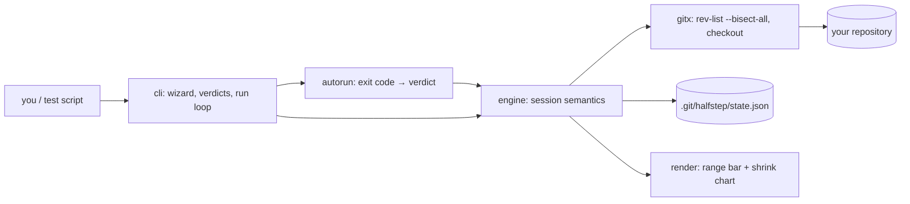

# halfstep

[English](README.md) | [中文](README.zh.md) | [日本語](README.ja.md)

[](LICENSE) [](go.mod) [](CHANGELOG.md)  [](CONTRIBUTING.md)

**halfstep：开源的 git bisect 引导式终端界面 —— 一个负责标记、自动运行并可视化嫌疑区间不断收缩的向导，直到第一个坏提交无处可藏。**


```bash
git clone https://github.com/JaydenCJ/halfstep && cd halfstep
go build -o halfstep ./cmd/halfstep    # single static binary, stdlib only
```

> 预发布：v0.1.0 尚未上架任何包管理器；请按上述方式从源码构建（任意 Go ≥1.22，PATH 上需有 git ≥2.30）。

## 为什么选 halfstep？

所有人都同意 `git bisect` 是最快却没人用的调试器。算法本身完美——log₂(n) 次 checkout 就能把任何回归逼入死角——但工作流对人很不友好：你得记住咒语的顺序（先 `start`，再 bad，再 good），过程中完全看不到自己走到哪了，一次敲错的 `good` 会悄悄毒害整场排查且无法撤销，收尾输出又是一堵只能选择相信的文字墙。TUI 们也救不了你：lazygit 把 bisect 藏在一个没有区间反馈的快捷键后面，tig 干脆没有 bisect 模式。halfstep 是一个前端，保留 git 自己的二分大脑（每个中点都由 `rev-list --bisect-all` 选出，所以合并提交的行为与 git 完全一致），并把它周围的一切都换掉：询问两个端点的启动向导、每次判定后的区间条和 `~N steps to go` 估计、把过去会葬送整场排查的误标一键撤销的 `undo`、完全遵循 `git bisect run` 退出码契约的 `run`，以及在 skip 挡住判定时诚实给出 `inconclusive` 嫌疑清单。状态存放在 `.git/halfstep/` 下的一个 JSON 文件里，绝不碰 `refs/bisect`，因此可与原生 git bisect 共存。

| | halfstep | git bisect | lazygit | tig |
|---|---|---|---|---|
| 引导式启动（提示输入端点） | ✅ 向导 | ❌ 需要背参数顺序 | ⚠️ 快捷键菜单 | ❌ 无 bisect 模式 |
| 每次判定后的区间可视化 | ✅ 区间条 + 收缩图 | ❌ 只有文字计数 | ❌ | ❌ |
| 剩余步数估计 | ✅ 每次标记后 | ⚠️ 仅开始时一次 | ❌ | ❌ |
| 撤销错误判定 | ✅ `undo` | ❌ 手动重放 log | ❌ | ❌ |
| 自动化排查 | ✅ `run`（bisect-run 退出码） | ✅ `bisect run` | ❌ | ❌ |
| 可脚本化的 JSON 状态 | ✅ `schema_version: 1` | ❌ | ❌ | ❌ |
| 运行时依赖 | 0（Go 标准库 + 你的 git） | —（它就是 git） | 约 40 个 Go 模块 | C + ncurses |

<sub>依赖数于 2026-07-13 核对：halfstep 只导入 Go 标准库，并调用你已有的 git 二进制；lazygit 0.4x 解析约 40 个模块；tig 链接 ncurses。halfstep v0.1.0 要求 good 是 bad 的祖先——即经典的"路径上的回归"场景。</sub>

## 特性

- **启动是对话而非咒语** —— `halfstep start` 会提示输入 bad 与 good 端点（bad 默认 HEAD），验证它们确实构成一个区间，拒绝践踏脏工作区，并立刻 checkout 第一个中点。
- **区间时刻可见** —— 每次判定都会打印一条把幸存候选映射到原始跨度上的桶压缩区间条、收缩差量（`23 → 11 candidates`）以及 `~N steps to go` 的折半估计；1000 个提交里的孤独幸存者也绝不会从条上消失。
- **误标可撤销** —— 过去一次错误的 `good` 意味着推倒重来；`halfstep undo` 通过重放其余标记收回最近一次判定，可连续使用任意次。
- **自动运行说 bisect-run 的语言** —— `halfstep run -- ./test.sh` 使用与 `git bisect run` 完全相同的退出码契约（0 好、125 跳过、1–127 坏、128+ 中止且不记录），现有 bisect 脚本无需修改即可使用，每步打印一行进度。
- **诚实的收尾** —— 找到时给出含作者、日期、主题与步数的元凶框；当只剩被跳过的提交时，给出明确的 `inconclusive` 嫌疑清单而不是伪造一个答案。
- **构造上的安全** —— 中点由 git 自己的 `rev-list --bisect-all` 选出（包括合并），互相矛盾的标记在落盘前就被拒绝，状态是 `.git/halfstep/` 下的一个原子写入 JSON 文件，`reset` 永远把你送回出发的分支。

## 快速上手

```bash
# something broke between the v1.2.0 release and today
halfstep start --good v1.2.0 --bad HEAD
```

真实捕获的输出：

```text
halfstep: hunting the first bad commit in 4f96b85..e7030f8 (23 commits)

  good 4f96b85 [███████████████████████] e7030f8 bad
  23 candidates · ~5 steps to go

→ checked out 6db2327 "chore: bump linters" (step 1)
  test it, then: halfstep good | halfstep bad | halfstep skip
  or hand the wheel over: halfstep run -- <your test command>
```

测试这个 checkout、标记它、看区间折半 —— 或者把剩下的交给自动化：

```bash
halfstep bad                       # this checkout is broken too
halfstep run -- ./test.sh          # let the test drive from here
```

```text
step 2  ✓ good  e9b0e4c perf: memoize glob matches       exit 0   ·  11 → 6   [·····██████············]
step 3  ✓ good  1faf8e9 fix: windows paths               exit 0   ·   6 → 3   [········███············]
step 4  ✗ bad   6c713d2 cache: drop rename invalidation  exit 1   ·   3 → 1   [········█··············]

┌──────────────────────────────────────────────
│ first bad commit: 6c713d2
│ author : Rin Developer <rin@example.test>
│ date   : 2026-06-06
│ subject: cache: drop rename invalidation
└──────────────────────────────────────────────
  found in 4 steps · 23 candidates narrowed to 1
  HEAD is on the culprit — 'halfstep reset' returns to main
```

`halfstep log` 以收缩图重放整场排查，`halfstep status --format json` 用稳定的 `schema_version: 1` 信封把同样的信息交给脚本。

## 命令与退出码

| 命令 | 作用 |
|---|---|
| `start [--bad rev] [--good rev]…` | 开始排查；缺失的端点会被提示输入；`--force` 跳过脏工作区检查 |
| `good` / `bad` / `skip [rev]` | 标记被测提交（或 `rev`）并前进到下一个中点 |
| `undo` | 收回最近一次判定（可连续撤销到起点） |
| `run -- <command…>` | 按 bisect-run 退出码语义自动排查；`--verbose` 直播测试输出 |
| `status [--format text\|json]` | 区间条与下一步指引，人读或机读 |
| `log` | 以比例收缩图呈现的判定历史 |
| `reset` | 回到原分支并清除会话（幂等） |

| 标志 | 默认值 | 效果 |
|---|---|---|
| `-C <dir>` | `.` | 针对另一个仓库运行，同 git 的 `-C`（放在子命令之前） |
| `--color` | `auto` | `auto`、`always` 或 `never` |
| `--width` | `40`（`log` 为 24） | 区间条 / 图表的单元格宽度 |

退出码：`0` 正常 · `1` 二分问题（无会话、矛盾、无法定论） · `2` 用法错误 · `3` git 或运行时错误。`run` 期间你的测试命令退出码含义：`0` 好、`125` 跳过、`1–127` 坏、`128+` 中止排查且不记录判定。

## 验证

本仓库不带任何 CI；上述每一条断言都由本地运行验证：

```bash
go test ./...            # 90 deterministic tests, offline, zero sleeps, < 30 s
bash scripts/smoke.sh    # full manual + automated hunt end to end, prints SMOKE OK
```

测试用固定的 `git fast-import` 流（固定身份与时间戳）构建真实仓库，因此每个 sha、每条区间条都可复现；引擎测试套件把 bug 埋进线性历史的**每一个**位置，断言排查恰好逼出那个提交、不超出 log₂ 预算，合并场景也在内。

## 架构



`render` 与 `autorun` 是纯逻辑（无 I/O），`engine` 拥有全部规则，只有 `gitx` 调用外部命令——且只调 plumbing 命令，绝不调 `git bisect` 本身。状态文件格式见 [docs/state-format.md](docs/state-format.md)。

## 路线图

- [x] v0.1.0 —— 启动向导、good/bad/skip/undo、兼容 bisect-run 的自动排查、区间条 + 收缩图、JSON 状态、90 个测试 + 冒烟脚本
- [ ] `halfstep terms`，用于非回归类排查（fixed/unfixed、old/new 标签）
- [ ] 面向 squash-merge 历史的 first-parent 模式
- [ ] Pathspec 收窄（`halfstep start -- src/parser/`）以缩小初始区间
- [ ] 从 `status --format json` 在新克隆里重放一场排查
- [ ] 基于同一引擎的可选全屏 TUI 模式

完整列表见 [open issues](https://github.com/JaydenCJ/halfstep/issues)。

## 参与贡献

欢迎 issue、讨论与 PR —— 本地工作流（格式化、vet、测试、`SMOKE OK`）见 [CONTRIBUTING.md](CONTRIBUTING.md)。入门任务标注为 [good first issue](https://github.com/JaydenCJ/halfstep/issues?q=is%3Aissue+is%3Aopen+label%3A%22good+first+issue%22)，设计讨论在 [Discussions](https://github.com/JaydenCJ/halfstep/discussions)。

## 许可证

[MIT](LICENSE)
